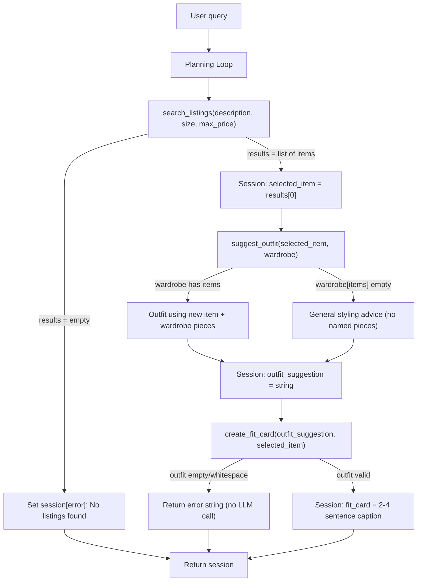

# FitFindr — planning.md

> Complete this document before writing any implementation code.
> Your spec and agent diagram are what you'll use to direct AI tools (Claude, Copilot, etc.) to generate your implementation — the more specific they are, the more useful the generated code will be.
> Your planning.md will be reviewed as part of your submission.
> Update it before starting any stretch features.

---

## Tools

List every tool your agent will use. For each tool, fill in all four fields.
You must have at least 3 tools. The three required tools are listed — add any additional tools below them.

### Tool 1: search_listings

**What it does:**
<!-- Describe what this tool does in 1–2 sentences -->
It takes what the user is looking for such as the description of the clothing, the size, and max price, and returns a list of matching listing dicts from listings.json sorted by relevance.

**Input parameters:**
<!-- List each parameter, its type, and what it represents -->
- `description` (str): the details of the clothing the user is looking for
- `size` (str): the clothing size the user is looking for
- `max_price` (float): the highest price the clothing found for what the user is looking for should be

**What it returns:**
<!-- Describe the return value — what fields does a result contain? -->
A list of the most relevant sorted listing dicts from listings.json. If none are found, should return an empty list. The dicts contain id, title, description, category, style_tags, size, condition, price, colors, brand, platform

**What happens if it fails or returns nothing:**
<!-- What should the agent do if no listings match? -->
Tell the user a listing can't be found for what the user asked and maybe to try describing differently. Nothing else should be called.

---

### Tool 2: suggest_outfit

**What it does:**
<!-- Describe what this tool does in 1–2 sentences -->
Takes in an item found from search_listings and the user's wardrobe and pairs the item with relevant pieces from the wardrobe to complete an outfit and return the suggestion to the user.

**Input parameters:**
<!-- List each parameter, its type, and what it represents -->
- `new_item` (dict): the listing dict that search_listing found for the user to buy
- `wardrobe` (dict): the user's wardrobe of pieces whose dict key is items and values a list of dicts of each piece with keys id, name, category, colors, style_tags, notes

**What it returns:**
<!-- Describe the return value -->
A string with outfit suggestions including the user's wardrobe pieces.

**What happens if it fails or returns nothing:**
<!-- What should the agent do if the wardrobe is empty or no outfit can be suggested? -->
If the wardrobe is empty, the string is populated with general styling advice for the new_item as an outfit suggestion.

---

### Tool 3: create_fit_card

**What it does:**
<!-- Describe what this tool does in 1–2 sentences -->
Generates a caption of the outfit for social media.

**Input parameters:**
<!-- List each parameter, its type, and what it represents -->
- `outfit` (str):  the outfit clothings from suggest_outfit
- `new_item` (dict): The listing dict for the thrifted item

**What it returns:**
<!-- Describe the return value -->
A string of 2-4 sentences to show off the outfit found in a social media caption. It should be casual and authentic and not read off a a product description.

**What happens if it fails or returns nothing:**
<!-- What should the agent do if the outfit data is incomplete? -->
If outfit is empty or missing, return a descriptive error message string — do NOT raise an exception.

---

### Additional Tools (if any)

<!-- Copy the block above for any tools beyond the required three -->

---

## Planning Loop

**How does your agent decide which tool to call next?**
<!-- Describe the logic your planning loop uses. What does it look at? What conditions change its behavior? How does it know when it's done? -->
Initialize the session with _new_session()

Parse the user's query to extract a description, size, and max_price using the LLM to parse it. Store the result in session["parsed"].

Call search_listings() with the parsed parameters. Store results in session["search_results"]. If no results: set session["error"] to a helpful message and return the session early. Do NOT proceed to suggest_outfit with empty input.

Select the item to use (e.g., the top result). Store it in session["selected_item"].

Call suggest_outfit() with the selected item and wardrobe. Store the result in session ["outfit_suggestion"].

Call create_fit_card() with the outfit suggestion and selected item. Store the result in session["fit_card"].

Return the session.
---

## State Management

**How does information from one tool get passed to the next?**
<!-- Describe how your agent stores and accesses state within a session. What data is tracked? How is it passed between tool calls? -->
There is a session dict created by _new_session at the start of each run that is read from in each step of the planning loop and written to so that the next tools can access previous data. It stores the original query string, parsed description, size, and max price from the query, search_results of the matching listing dicts, selected_item for top result, wardrobe for the user's wardrobe dict, the outfit_suggestion string, fit_card string, and error in case interaction ended early. At the start of a new session, the session dict only has the query and wardrobe and everything else is set to none or empty. error is set by the agent if a step can't continue such as if search_results is empty and error is read first by caller to ensure a step can be done. The session will then be returned.

---

## Error Handling

For each tool, describe the specific failure mode you're handling and what the agent does in response.

| Tool | Failure mode | Agent response |
|------|-------------|----------------|
| search_listings | No results match the query | tool returns empty list. Agent sets session["error"] to a helpful message like "No results match the query. Try a different description or a higher max price." and returns the session early. Nothing else gets called. |
| suggest_outfit | Wardrobe is empty | Agent notices wardrobe["items"] is empty and asks LLM for general styling advice for the item and returns a non-empty string. Call create_fit_card next. |
| create_fit_card | Outfit input is missing or incomplete | Guards against empty outfit input and returns an error that "A fit card can't be made: No outfit suggestion was provided." The agent tells the user such. |

---

## Architecture

<!-- Draw a diagram of your agent showing how the components connect:
     User input → Planning Loop → Tools (search_listings, suggest_outfit, create_fit_card)
                                                                          ↕
                                                                   State / Session
     Show what triggers each tool, how state flows between them, and where error paths branch off.
     ASCII art, a Mermaid diagram (https://mermaid.js.org/syntax/flowchart.html), or an embedded
     sketch are all fine. You'll share this diagram with an AI tool when asking it to implement
     the planning loop and each individual tool. -->

---

## AI Tool Plan

<!-- For each part of the implementation below, describe:
     - Which AI tool you plan to use (Claude, Copilot, ChatGPT, etc.)
     - What you'll give it as input (which sections of this planning.md, your agent diagram)
     - What you expect it to produce
     - How you'll verify the output matches your spec before moving on

     "I'll use AI to help me code" is not a plan.
     "I'll give Claude my Tool 1 spec (inputs, return value, failure mode) and ask it to implement
     search_listings() using load_listings() from the data loader — then test it against 3 queries
     before trusting it" is a plan. -->

**Milestone 3 — Individual tool implementations:**
I'll give Claude my Tool specs and the provided tool stubs separately asking to implement search_listings first, then suggest_outfit, then create_fit_card with each tool's input return value and failure mode. Between each tool implementation, I'll test the tools. For search_listings, I'll test with multiple queries to make sure relevant results are given from load_listings in order or that a message is given if none can be found and no exceptions. For suggest_outfit, I'll test to make sure the example user's wardrobe input is used in the reponse and empty wardrobe returns a general styling response. For create_fit_card I'll make sure the response is a casual authentic caption or that an error message is given if there's no complete outfit input and not crash.

**Milestone 4 — Planning loop and state management:**
I'll give Claude the planning loop and state management section of this document along with the architecture. Alongside, I'll give the agent.py to ensure proper structure and understanding. I expect the parsing to work correctly extracting the needed inputs for search_listings, the session to be maintained and updated correctly, and that the planning loop steps are in order. I'll test to verify the code is right using the provided CLI test with the example queries and checking for the expected outputs.

---

## A Complete Interaction (Step by Step)

Write out what a full user interaction looks like from start to finish — tool call by tool call. Use a specific example query.

**Example user query:** "I'm looking for a vintage graphic tee under $30. I mostly wear baggy jeans and chunky sneakers. What's out there and how would I style it?"

**Step 1:**
<!-- What does the agent do first? Which tool is called? With what input? -->
First the agent will use search_listings tool with descriptions of what the user is looking for which is description = "vintage graphic tee" and max_price = 30.0.

**Step 2:**
<!-- What happens next? What was returned from step 1? What tool is called now? -->
search_listings returns the best matching listings from listings.json sorted by relevance to the inputs and picks the top result. In this example the listings with vintage graphic tee and max price of 30 are most relevant such as "Graphic Tee — 2003 Tour Bootleg Style", "Vintage Band Tee — Faded Grey", and "Y2K Baby Tee — Butterfly Print". For this example let's say the most relevant is "Graphic Tee — 2003 Tour Bootleg Style" — $24, good condition, size L, on depop. Then suggest_outfit is called with this selected item and the user's wardrobe. It checks whether wardrobe is empty in which an outfit suggestion is created based on the item selected. If the user's wardrobe is not empty an outfit suggestion is made with the selected item and items from the wardrobe.

**Step 3:**
<!-- Continue until the full interaction is complete -->
The example user's wardrobe is used and suggest_outfit returns the outfit suggestion as a string. An example of the return could be "Pair this with your baggy straight-leg jeans and chunky white sneakers for a vintage streetwear look." Then create_fit_card is called with the outfit suggestion and the new item selected and returns some sentences that is usable for social media posting about the new found outfit. For example, "Found this 'Graphic Tee — 2003 Tour Bootleg Style' on depop for $24 and I had to grab it 🖤 Throwing it on with my baggy straight-leg jeans and chunky white sneakers for that worn-in vintage streetwear vibe. Bootleg tour tees just hit different. #thriftfind #ootd"

**Final output to user:**
<!-- What does the user actually see at the end? -->
The user sees the three pieces strung together into one response:
1. **The find** — the top listing from search_listings: "Graphic Tee — 2003 Tour Bootleg Style" — $24, good condition, size L, on depop.
2. **How to style it** — the suggest_outfit string: "Pair this with your baggy straight-leg jeans and chunky white sneakers for a vintage streetwear look."
3. **A shareable fit card** — the create_fit_card caption, ready to copy-paste into an Instagram/TikTok post: "Found this 'Graphic Tee — 2003 Tour Bootleg Style' on depop for $24 and I had to grab it 🖤 Throwing it on with my baggy straight-leg jeans and chunky white sneakers for that worn-in vintage streetwear vibe. Bootleg tour tees just hit different. #thriftfind #ootd"
